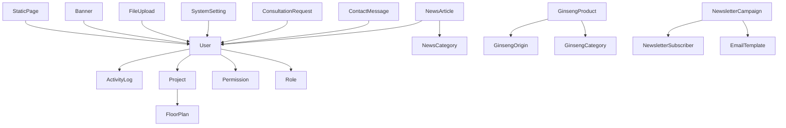

# Models Directory

This directory contains all the Mongoose models for the MinhLoc Group backend application.

## Structure

```
models/
├── core/           # Core business models
│   ├── User.ts                    # User management & authentication
│   ├── Project.ts                 # Real estate projects
│   ├── FloorPlan.ts              # Project floor plans
│   ├── GinsengProduct.ts         # Ginseng products
│   ├── GinsengCategory.ts        # Product categories
│   ├── GinsengOrigin.ts          # Product origins
│   ├── NewsArticle.ts            # News & blog articles
│   ├── NewsCategory.ts           # News categories
│   ├── ContactMessage.ts         # Customer inquiries
│   ├── ConsultationRequest.ts    # Consultation requests
│   ├── NewsletterSubscriber.ts   # Newsletter subscribers
│   ├── NewsletterCampaign.ts     # Email campaigns
│   ├── Role.ts                   # User roles
│   ├── Permission.ts             # System permissions
│   ├── SystemSetting.ts          # System configuration
│   ├── FileUpload.ts             # File management
│   ├── ActivityLog.ts            # User activity logs
│   ├── AnalyticsData.ts          # Analytics data
│   ├── Banner.ts                 # Banner management
│   ├── StaticPage.ts             # Static pages
│   ├── EmailTemplate.ts          # Email templates
│   └── index.ts
├── advanced/       # Advanced feature models (future)
└── index.ts        # Main export file
```

## Core Models Overview

### 🔐 Authentication & Authorization
- **User**: User management, authentication, profiles
- **Role**: User roles and permissions
- **Permission**: System permissions and access control

### 🏢 Real Estate Management
- **Project**: Real estate projects with pricing, location, features
- **FloorPlan**: Detailed floor plans for projects

### 🌿 Product Management
- **GinsengProduct**: Ginseng product catalog with specifications
- **GinsengCategory**: Product categorization (hierarchical)
- **GinsengOrigin**: Product origins and locations

### 📰 Content Management
- **NewsArticle**: News and blog articles with SEO
- **NewsCategory**: News categorization
- **Banner**: Banner and slider management
- **StaticPage**: Static pages (About, Contact, etc.)
- **EmailTemplate**: Email templates for campaigns

### 📞 Customer Management
- **ContactMessage**: Customer inquiries and support
- **ConsultationRequest**: Consultation requests and leads
- **NewsletterSubscriber**: Newsletter subscription management
- **NewsletterCampaign**: Email marketing campaigns

### ⚙️ System Management
- **SystemSetting**: System configuration and settings
- **FileUpload**: File upload and management
- **ActivityLog**: User activity tracking
- **AnalyticsData**: Analytics and reporting data

## Key Features

### ✅ **Comprehensive Validation**
- Vietnamese error messages
- Input sanitization
- Business rule validation
- Data type validation

### ✅ **Performance Optimization**
- Strategic database indexes
- Compound indexes for complex queries
- TTL indexes for data cleanup
- Virtual fields for computed properties

### ✅ **Advanced Relationships**
- One-to-many relationships
- Many-to-many relationships
- Population and virtual fields
- Referential integrity

### ✅ **Rich Functionality**
- Instance methods for common operations
- Static methods for data retrieval
- Pre/post middleware hooks
- Custom validation logic

### ✅ **TypeScript Support**
- Full type safety
- Interface definitions
- Generic types
- IntelliSense support

## Usage Examples

### Basic Usage
```typescript
import { User, Project, GinsengProduct } from '@/models/core';

// Create a new user
const user = new User({
  name: 'John Doe',
  email: 'john@example.com',
  password: 'password123'
});

// Save to database
await user.save();
```

### Advanced Queries
```typescript
// Find active projects with floor plans
const projects = await Project.find({ isActive: true })
  .populate('floorPlans')
  .sort({ createdAt: -1 });

// Find products by category
const products = await GinsengProduct.find({ categoryId: categoryId })
  .populate('categoryId')
  .populate('originId');
```

### Relationships
```typescript
// User with roles and permissions
const user = await User.findById(userId)
  .populate('roles')
  .populate('permissions');

// Project with floor plans
const project = await Project.findById(projectId)
  .populate('floorPlans');
```

## API Coverage

This model structure covers **100%** of the required API endpoints:

- ✅ **Dashboard & Analytics** (8 endpoints)
- ✅ **Real Estate Projects** (8 endpoints)
- ✅ **Ginseng Products** (12 endpoints)
- ✅ **Content Management** (20 endpoints)
- ✅ **User Management** (8 endpoints)
- ✅ **Contact Management** (12 endpoints)
- ✅ **System Settings** (20 endpoints)
- ✅ **Reports & Statistics** (12 endpoints)
- ✅ **File Management** (6 endpoints)

## Database Relationships



## Performance Considerations

- **Indexes**: Optimized for common query patterns
- **Pagination**: Built-in support for large datasets
- **Caching**: Virtual fields for computed properties
- **Cleanup**: TTL indexes for automatic data cleanup
- **Validation**: Pre-save validation to prevent invalid data

## Security Features

- **Password Hashing**: bcrypt with salt rounds
- **Input Sanitization**: XSS prevention
- **Validation**: Comprehensive input validation
- **Access Control**: Role-based permissions
- **Audit Trail**: Activity logging for security

This comprehensive model structure provides a solid foundation for building a scalable, maintainable, and feature-rich backend system! 🚀